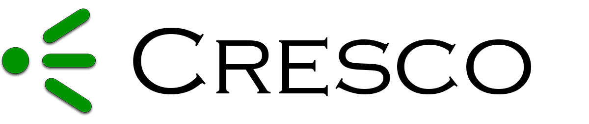

======

Cresco is a free and open source edge computing framework.

#### Cresco Framework Core
 * [Cresco-Agent](https://github.com/ResearchWorx/Cresco-Agent): The main runtime which manages the loading of Cresco Plugins and logging.
 * [Cresco-Agent-Controller-Plugin](https://github.com/ResearchWorx/Cresco-Agent-Controller-Plugin): The main communications plugin for the Cresco Framework which establishes channels for message passing between agents in a tiered system. At this time this plugin is **required** for operation.
 
#### Cresco Framework Optional Plugins
 * [Cresco-SysInfo-Plugin](https://github.com/ResearchWorx/Cresco-SysInfo-Plugin): This plugin provides computational resource utilization for the machine hosting the Cresco Agent as messages sent back to a Global Controller.
 
#### Cresco Framework Example Plugins
 * [Cresco-Skeleton-Plugin](https://github.com/ResearchWorx/Cresco-Skeleton-Plugin): This project exists as a basic starting point for building a custom Cresco plugin.

#### Cresco Agent Topology
Cresco agents, through their Cresco-Agent-Controller-Plugin, arrange themselves into a hierarchy of a global, with a single controller, regions, each with a single regional controller, and a set of agents inside a region. The following diagram illustrates this hierarchy:

This topology allows for distributed control, meaning that an agent controls its plugins, a region controls its agents and the global controls the regions over which it is in charge.

#### Why the name Cresco?
 
* Proto-Indo-European *ker ("to grow"). 
* Old Armenian սերիմ (serim, "be born") and սերեմ (serem, "bring forth")
* Latin creare ("become visible, multiply, augment")